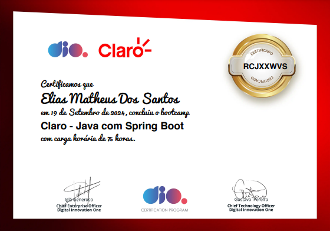

# Bootcamp Dio - Java Projects

Este repositório contém todos os projetos desenvolvidos durante o Bootcamp Dio, organizado por pastas. Cada pasta contém um projeto específico e uma breve descrição.

## Projetos

## 1. Abstraindo um Bootcamp Usando Orientação a Objetos em Java
**Descrição do projeto:** Este projeto visa modelar a estrutura de um bootcamp utilizando os princípios da orientação a objetos em Java. Ele abrange a criação de classes para representar participantes, instrutores e cursos, além de implementar funcionalidades para inscrição, geração de certificados e gerenciamento de progresso dos alunos. Através deste projeto, foram aplicados conceitos como encapsulamento, herança e polimorfismo.

## 2. ContaBanco
**Descrição do projeto:** O projeto `ContaBanco` é uma simulação de um sistema bancário em Java, onde são implementadas funcionalidades básicas de uma conta bancária. O sistema permite a criação de contas, depósitos, saques e consulta de saldo. A abordagem orientada a objetos é utilizada para garantir a organização e a reutilização do código, criando uma estrutura clara e eficiente para a manipulação dos dados financeiros.

## 3. Criando um Banco Digital com Java e Orientação a Objetos
**Descrição do projeto:** Este projeto se concentra na criação de um banco digital, aproveitando os conceitos de orientação a objetos em Java. O sistema simula operações bancárias comuns, como transferências e pagamentos, além de implementar autenticação e controle de acesso. Através deste projeto, foi possível entender a importância da segurança em sistemas financeiros e aplicar boas práticas de programação para desenvolver uma aplicação robusta e escalável.

## 4. DesafioControleFluxo
**Descrição do projeto:** O projeto `DesafioControleFluxo` explora o uso de estruturas de controle de fluxo em Java, como condicionais e loops. O objetivo é resolver desafios que envolvem a tomada de decisões e a repetição de tarefas, ajudando a solidificar a compreensão das lógicas de programação. Os exercícios propostos foram fundamentais para desenvolver o raciocínio lógico e a capacidade de resolver problemas de forma eficaz.

## 5. Modelando o iPhone com UML
**Descrição do projeto:** Este projeto utiliza a UML (Unified Modeling Language) para modelar as funcionalidades e características do iPhone. Através da criação de diagramas de classes, casos de uso e sequência, é possível visualizar a estrutura do sistema e suas interações. Essa prática fortalece o entendimento sobre como a UML pode ser uma ferramenta poderosa para o planejamento e design de software.

## Conclusão
Participar do bootcamp Claro - Java com Spring Boot foi uma experiência enriquecedora e transformadora. Ao longo do curso, tive a oportunidade de aplicar conceitos teóricos em projetos práticos que não apenas consolidaram meu aprendizado, mas também me permitiram desenvolver habilidades essenciais para o mercado de trabalho. A troca de experiências com instrutores e colegas foi fundamental para a construção de uma rede de contatos e para a motivação de continuar evoluindo na área de programação. Estou animado para aplicar tudo o que aprendi em projetos futuros e desafios na minha carreira.

